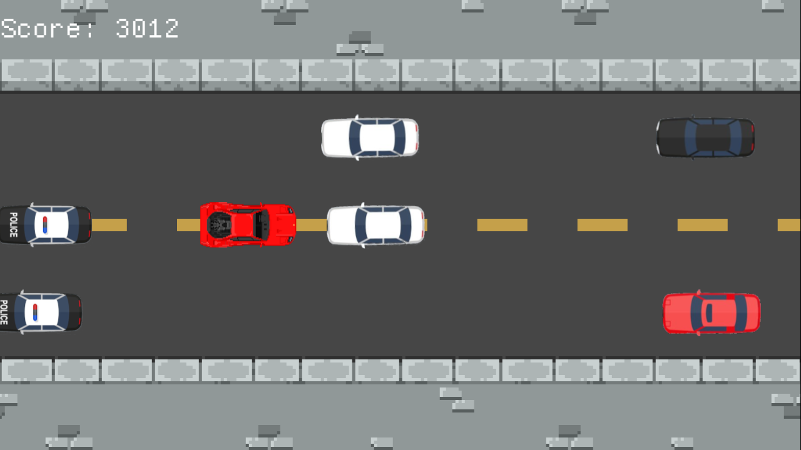

# Rusty Corks

## Gameplay

Come and do the impossible in Rusty Corks, where you have to drive a car in the opposite direction to the traffic!
Drive to the rhythm of the music to ensure your survival, but be careful: the more cars you overtake,
the faster they go!

## Features

- You can pause the game by pressing `space` (with default key bindings)
- You can change the key bindings in the `config.rs` file
- You can change the music in the `config.rs` file
- Show key bindings in the main menu
- Bots spawn randomly
- Speed increases as you progress
- Music is played in the background
- Score is displayed in the top left corner
- Game over screen is displayed when you lose 